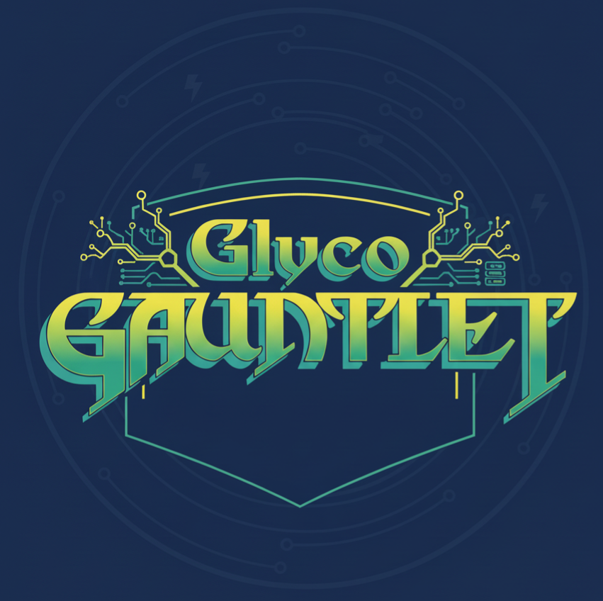

<p align="center">
  
</p>

# GlycoGauntlet

Predict glycan structures from mass spectrometry glycomics data. Beat our deep learning model (CandyCrunch) or provide expert manual annotations.

## Task

Given Excel files containing LC-MS/MS glycomics runs (thousands of spectra per file), predict the glycan structure for each detected peak (Alternatively, raw files are available here: https://zenodo.org/records/19221873). All files are negative ion mode, reduced animal glycans, run on a PGC column. All files come from separate samples (not replicates) and represent a full LC-MS/MS run. Input files contain m/z, retention time, fragmentation peak dictionaries, and intensity data. Your job is to output glycan structures in any common notation (e.g., IUPAC-condensed, GlyTouCan IDs, etc), as well as where they're found (m/z + retention time), either as an Excel file or as a GlycoWorkbench file (.gwp).

If you provide submissions for private files (one submission per file), you will be invited to be a co-author on the GlycoGauntlet paper (public file submissions optional but encouraged for an even better paper/comparison:-) ).

## Evaluation

Your predictions are matched to ground truth spectra using mass (±0.5 Da) and retention time (±1.0 min) tolerance. Scoring uses a soft F1 metric where exact structural matches get 1.0 and partial matches get cosine similarity based on motif fingerprints. False positives and false negatives are penalized. See `evaluation/evaluate_submission.py` for the exact implementation.

Public file submissions are immediately scored and scores will be displayed on a public leaderboard. Private file submissions will also be scored but scores will be hidden until the end of the competition. You can submit as many attempts as you want

## Data

**Training**: Full annotated dataset at https://zenodo.org/records/10997110 (multiple glycomics runs, hundreds of thousands of annotated spectra)

**Public Test**: Files in `data/public_test/` with ground truths as `_solution.csv` files. Files in `.mzML` format can be found here at https://zenodo.org/records/19221873

**Private Test**: Hidden, scored only at competition end. Files are named in the format `ID_GlycanClass_GlycanDerivatization.xlsx`.  Files in `.mzML` format can be found here at https://zenodo.org/records/19221873

## Submission Format

Your predictions must be Excel files matching the input filenames, with this exact structure:

| Column | Type | Description |
|--------|------|-------------|
| m/z | float | Observed mass-to-charge ratio |
| charge | int | Signed charge (e.g., -1 for negative mode) |
| RT | float | Retention time in minutes |
| top1_pred | str | Predicted glycan in IUPAC-condensed notation |

Index should be integer row numbers. Additional columns (confidence scores, alternative predictions) are allowed but ignored.

**Example row:**
```
m/z: 1235.19, charge: -1, RT: 17.63, top1_pred: Man(a1-3)[Man(a1-6)]Man(a1-6)[Man(a1-3)]Man(b1-4)GlcNAc(b1-4)GlcNAc
```

## How to Participate

1. Prepare your prediction CSV files following the format above
2. Validate locally: `python validation/check_format.py your_predictions/`
3. Go to [Issues](../../issues/new/choose) and select "Submit Predictions"
4. Enter your GitHub username and attach your CSV files
5. Submit the issue

A bot will automatically create a PR, run evaluation, and update the leaderboard. Check the issue for status updates.
Alternatively, you can submit your annotations on our [web portal](https://glycogauntlet.streamlit.app/)

## Baseline

CandyCrunch2 (our model) achieves F1=0.75 on the public test. Code: https://github.com/BojarLab/CandyCrunch

To generate baseline predictions:
```python
from candycrunch.prediction import wrap_inference
preds = wrap_inference("data/public_test/example.xlsx", glycan_class='N')
preds.to_csv("submissions/baseline/public/example_submission.csv")
```

## Leaderboard

See [leaderboard/public.md](leaderboard/public.md) for current rankings on public test set. Note that people may simply submit the solutions to the public test set, so consider perfect-ish solutions with caution:-)

Final rankings on private test set will be revealed after competition closes on October 2026 (tentative).

## Manual Annotation

You don't need code. Annotate spectra in Excel, format as above, submit. Many of the best glycomics annotations come from expert knowledge, not algorithms. If you do submit manual annotations, we would me much obliged if you could note down how long each file approximately took you

Submit your solutions [here](https://glycogauntlet.streamlit.app/)

## Questions

Open an issue or see the full evaluation code in `evaluation/`.